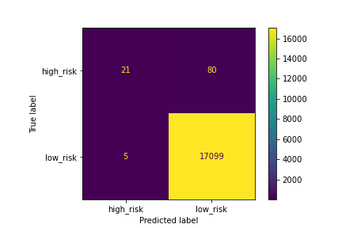
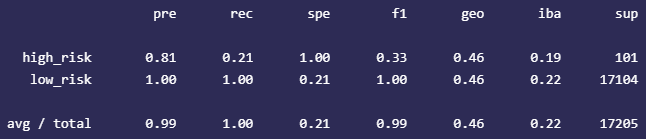
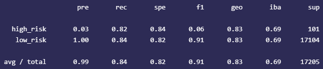
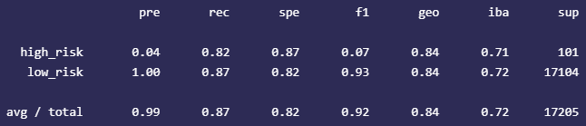
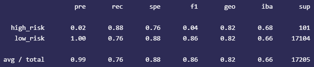
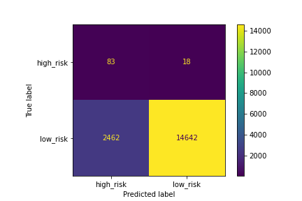
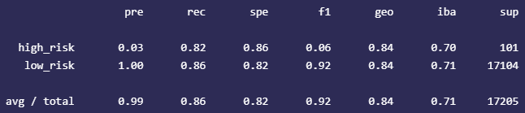
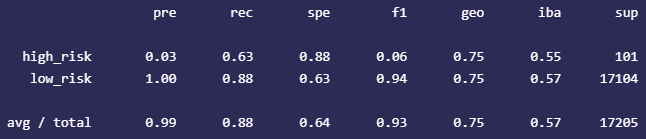
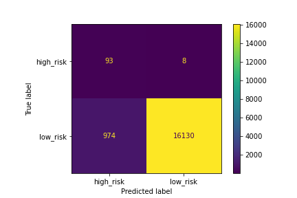
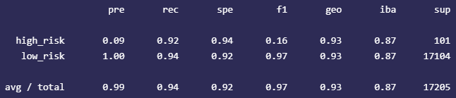

# Credit Risk Analysis

## Overview
A financial loan dataset was analyzed using a variety of machine learning algorithms to explore handling an imbalanced classification problem. The dataset contains 5% high-risk loans and 95% low-risk loans. Approaches such as no sampling, oversampling, undersampling, and ensemble learning were compared in precision, recall, accuracy, and f-score.

## Technologies Used

* Python, Pandas, Matplotlib, scikit-learn, imbalanced-learn

* VS Code, Jupyter Notebook

## Results

### Baseline (No Sampling)

Accuracy = 99.5%

### Random Oversampling

Accuracy = 83.2%

### SMOTE Oversampling

Accuracy = 84.4%

### Cluster Centroids Undersampling

Accuracy = 82.0%

### SMOTEENN Combination Sampling

Accuracy = 83.9%

### Balanced Random Forest

Accuracy = 75.9%

### Easy Ensemble AdaBoost

Accuracy = 93.2%

## Summary

All algorithms produced results with a lower F1 score and precision than the baseline that used no sampling. All algorithms tested, however, did have higher recall than the baseline.

In this application, the recall score is probably most useful, as it is safer for the lender to falsely predict a low-risk loan as being high-risk, than to predict a low-risk loan as being high-risk. EasyEnsemble, having the highest sensitivity and F1 score (as well as highest precision among algorithms), appears to be the most useful model for this application and dataset.
